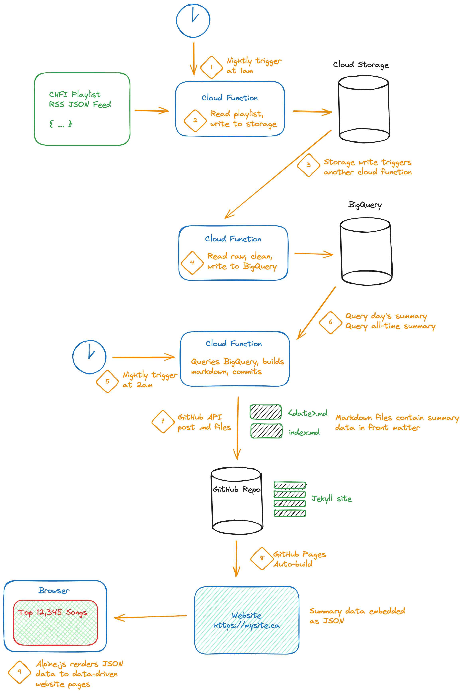

# 2023's Christmas Songs
> Exploring the Christmas music played on Toronto's CHFI radio station during the 2023 holiday season

Every year, CHFI plays Christmas music exclusively between mid/late-November and Christmas day. Ask most people
who work somewhere with piped-in music playing and they'll tell you they hear the same songs again and again.
But do they? This project helps answer questions like:
- How many different Christmas songs are played?
- How many times did I hear _It's the Most Wonderful Time of the Year_ on December 15?
- How many Christmas songs by _Michael Bublé_ can there possibly be?
- What version of _Winter Wonderland_ is played most often?
- What's the top song of the year? _Rocking Around the Christmas Tree_ or _Rudolph_?
- Has _Engelbert Humperdinck_ received the numerous plays he surely deserves for his haunting version of _Winter Wonderland_?

**The answers lie here: https://www.robharper.ca/xmas-songs-2023/**

## How it's built
